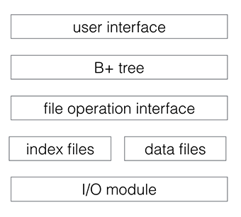
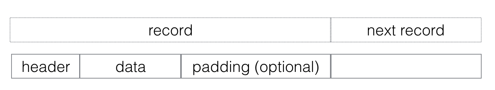
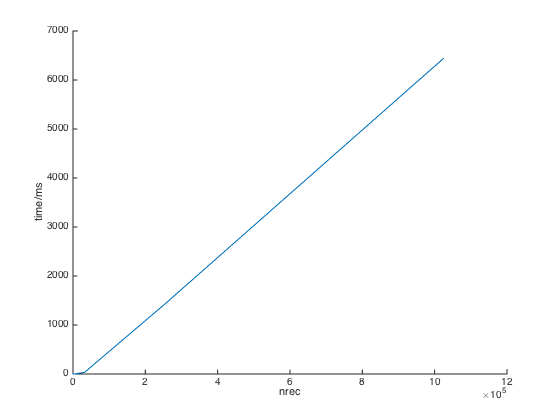
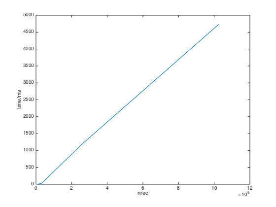
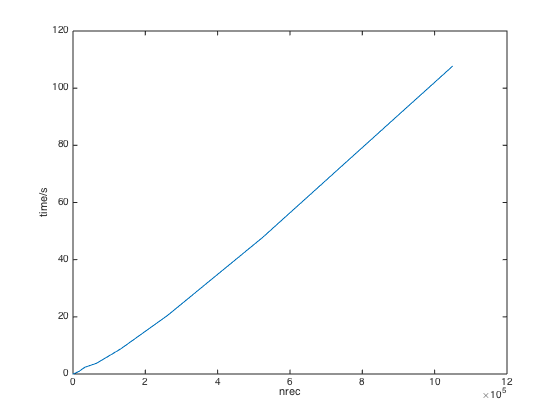

# Overview
The NaiveDB is a cross-platform lightweight persistent key-value store library. Keys are C++ strings and values are byte arrays with arbitrary size. Since values are stored as bytes, any type of data can be stored as long as it can be serialized into an array of bytes. Helper template functions are provided for convenient serialization and deserialization for POD (plain old data) types. Several platforms are supported, including Windows and POSIX compatible systems such as Linux and OS X.

# Getting Started

```  
#include <string>
#include "database.h"

using namespace naivedb;

int main() {  

  // create or open database

  const std::string database_name = "database";
  DatabaseOption option;
  // set max memory to 1GB
  option.memory_limitation = 1024 * 1024 * 1024;
  Database *db = new Database(database_name, option);


  // write

  int value = 1;
  db->set("1", (void *)&value, sizeof(value),
          false /* overwrite not allowed */);
  db->set<int>("2", 2, false);


  // read

  int value_length = db->get("1", (void *)&value);
  db->get<int>("2"); // return 2


  // remove
  db->remove("1");


  // close database
  delete db;

  return 0;
}  
```  

# Build
```
cmake -DCMAKE_BUILD_TYPE=Release .
cmake --build .
```


# Implementation Notes

## Architecture
The database is consisted of several modules as illustrated below.  



User interface hides implementation details and provides users with a series of APIs. Data is organized by B+ tree. B+ tree operates on index and data files via file operation interface, which provides interface to access data and allocate or deallocate space in files. B+ tree is stored in index files, while data (keys and values) is stored in data files. I/O modules encapsulate platform related APIs and provides uniform interfaces of file I/O.

## Data Organization

### File
Each database is represented by a set of files with the same prefix of file name stored in a directory. There are two types of files: index file and data file.
Each file contains a number of records, whether empty or not, which are continuous bytes in files and are basic units of data. Files are fixed-sized. Files of each type have a file number starting from 1 and a header stored in a file with file number 0. Information of all files of the same type is stored in the header.

### Index File
Index files contains a number of contiguously located index records. All index files have the same size of 16 MB. Index record is a structure with fixed size as illustrated below:  
```
struct IndexRecord {
  union {
    BPlusNodeData data; // for non-empty record
    Location next; // for empty record
  };
};

```
Empty index records are stored as a linked list with head of the list stored in the header. Each non-empty index record represents a single node in B+ tree. Root of the B+ tree is stored in the header. Data of nodes in B+ tree stored in index records is consisted of a bool field indicating whether it is leaf node, and locations of child nodes in index files, or keys or values in data files. New index files will be created if no empty records exist in the linked list when allocating new index records.

The order of B+ tree is 8 as benchmark shows the best performance in this case. Although larger order reduces tree height of the tree, it becomes inefficient for some linear algorithms used during construction and adjustment of B+ tree.

We utilize lazy deletion technique, which imposes no constraints on the number of entries left in the nodes in B+ tree after deletion, allowing them to empty completely before simply removing them. When a entry is removed, lazy deletion prevents overhead of adjusting potentially unbalanced tree. However, in some situations, the tree can be unbalanced and inefficient.


### Data File
Data records are stored in data files. All data files have the same size of 32 MB. Each data record represents a entry of keys or values. The structure of data records is illustrated below:
```
struct DataRecord {
  int block_size; // size of this record (excluding 'block_size')
  union {
    int data_size; // for non-empty record, size of data
    Location next; // for empty record
  };
  void *getData() { return (void *)(&data_size + 1); }
};
```  

  

The data record is consisted of a header, data, and some extra space or padding. The header of data records contain size of data and padding are stored in header of data records. Since size of data and padding can be arbitrary, data record does not have actual data and padding fields. When allocating space for data records, extra space is allocated to cover data and padding.  

Similar to index files, empty records are stored as linked list and head of list is stored in the header. However, in data files, multiple linked lists exist, which contain empty data records with size no less than 32 bytes, 64 bytes, ... , 4 MB, 8 MB. Thus, when allocating new data records, we can easily find empty records with the right size. If no empty records with the right size are available, next linked list will be checked or new data files will be created. Max size of a single entry is determined by the size of data file. Thus, size of key or value has a maximum of about 32 MB.

After a empty record with the right size is found, we split the record into two records and put the remained empty record back to a certain linked list. If the size of the remained empty record is too small for further use, space of the empty record will be discarded and added to the newly allocated record as its padding.  

When a entry is removed from database, the record is simply added to a linked list containing other empty records.   

Besides, byte alignment technique is used for better I/O performance. The size of record to allocate is always rounded up to times of four bytes.

## I/O Module
I/O module provides uniform cross-platform interface to system file I/O APIs.  

The storage engine is based on memory mapped files. It excels at workloads with high volume inserts, reads, and in-place updates. Besides, data synchronization between memory and disk files is maintained by operating system.

LRU algorithm is used to manage memory mapped files. Every time there is an I/O operation on a file, it first checks whether the requested file is mapped in memory. If not, system API will be called to mapped the whole file into memory. When establishing memory map, total size of memory mapped files will be checked to ensure that it will not exceed the memory limitation specified by users. If available memory is not enough, LRU (least recently used) memory mapped files will be unmapped so that memory will be released. With LRU algorithm, memory usage can be limited to a certain level.


# Test
A number of well designed unit tests based on GoogleTest framework are included.

Besides, STL map is used to check the correctness of database operations following these steps:

1. Randomly generate a number (more than one million) of keys and values and insert them into both map in STL and database in alphabetical order or arbitrary order.
2. Compare values of each key between map and database.
3. Delete all keys from database.
4. Check whether the keys have been deleted in database.


# Benchmark

## Specification
```
CPU:        2.9 GHz Intel Core i5
CPUCache:   3 MB
Memory:     16 GB
Disk:       APPLE SSD SM1024G
Keys:       16 bytes each
Values:     100 bytes each
```

## Writes Performance
Create a new database and randomly generate and insert nrec entries into the database.
```
nrec   Time(ns)   CPU(ns)  Iterations
--------------------------------------------
2           17464        13808     57440  16.0239MB/s   141.452k items/s
8           77832        59565     10000   14.858MB/s    131.16k items/s
64         417730       387433      1858  18.2743MB/s   161.318k items/s
512       2677065      2654426       265  21.3382MB/s   188.365k items/s
4k       21518204     21391333        36  21.1826MB/s   186.992k items/s
32k     169052887    168748400         5  21.4817MB/s   189.631k items/s
256k   1450641394   1440480000         1  20.1322MB/s   177.719k items/s
1024k  6463718176   6437704000         1  18.0188MB/s   159.063k items/s
```

The figure below shows time complexity of insertion is approximately O(nlogn).
  

## Reads performance
Create a database with one million entries and perform nrec read operations.
```
nrec   Time(ns)   CPU(ns)  Iterations
--------------------------------------------
2           18048        13072     47620  16.9262MB/s   149.417k items/s
8           40960        39985     17188  22.1336MB/s   195.386k items/s
64         309110       305307      2310    23.19MB/s   204.712k items/s
512       2712878      2614599       302  21.6632MB/s   191.234k items/s
4k       18545497     18337323        31  24.7105MB/s   218.134k items/s
32k     148555660    148186400         5  24.4624MB/s   215.944k items/s
256k   1182049751   1179927000         1  24.5778MB/s   216.963k items/s
1024k  4745830297   4726068000         1  24.5447MB/s   216.671k items/s
```

The figure below shows time complexity of search is approximately O(nlogn).

  

## Mixed Operations Performance
1. insert NREC entries
2. fetch these entries
3. loop for 5 * NREC times:  
a. randomly fetch an entry
b. randomly delete an entry, every 37 times
c. insert an entry and fetch it, every 11 times
d. randomly replace an entry, every 17 times  
4. delete all entries; for each deletion, randomly fetch 10 records.

The result is shown in the figure below.  
  


# API Reference

## struct DatabaseOption
Represents user settings when creating or opening database.

* member memory_limitation
default value: 1024 * 1024 * 1024
Max amount of memory usage in bytes of memory mapped files. This should be at least 1024 * 1024 * 128 (128 MB).

## class Database
Represents a database and provides user interface to operations on the database.

### constructor

```
Database(const std::string &name, const DatabaseOption &option);
```

Open database or create if not exists.  
name: name of the database to be opened or created.  
option: user settings when creating or opening database.  

### destructor
Close the opened database and all releated files.

### method get

```  
(1) int get(const std::string &key, void *buf);
(2) template<T, class = typename enable_if<is_pod<T>::value, bool>::type>  
    T get(const std::string &key);
```  

Search the value with specified key. Raise NotFoundException if key does not exist.  

(1) buf: value will be copied to buffer with starting address specified by buf. Size of buffer should be large enough to contain the value. Returns size of value.  
(2) Returns the value with specified key.  

### method set

```  
(1) void set(const std::string &key,
             const void *value,
             int len, bool overwrite = false);

(2) template<T, class = typename enable_if<is_pod<T>::value, bool>::type>  
    void set(const std::string &key,
             const T& value,
             bool overwrite = false);
```  
Save key and value in database.

len: size of value.
overwrite: Overwrite the existing value if key to be inserted exists in database if overwrite is true. Otherwise, DuplicateException is raised.

### method remove

```
void remove(const std::string &key);
```

Remove key and its value from database. Raise NotFoundException if key does not exist.
