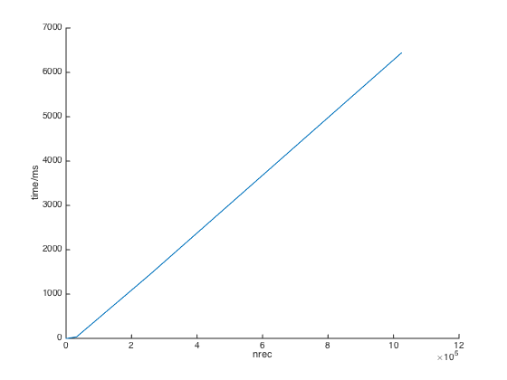

% Simple Database
% 515030910268 \and Lin Wuwei
% 2016/07/30

## Features
* Key type: C++ string
* Value type: array of bytes
* B+ tree index
* MMIO
* CURD supported
* Cross platform

## Example


```
  // create or open database
  DatabaseOption option;
  option.memory_limitation = 1024 * 1024 * 1024;
  Database db("database_name", option);

  // write
  int value = 1;
  db.set("1", (void *)&value, sizeof(value), false);
  db.set<int>("2", 2, false);

  // read
  int value_length = db->get("1", (void *)&value);
  db.get<int>("2"); // return 2

  // remove
  db.remove("1");
```  


## Architecture
  

## Files
* index files (B+ tree)
* data files (keys or values, referenced in index files)
* consisted of a number of records

### fixed-sized files
* header (file 0)
* file 1
* ...
* file n

## Index
```
struct IndexRecord {
  union {
    BPlusNodeData data; // for non-empty record
    Location next; // for empty record
  };
};

```

* Empty records stored as a linked list with head stored in the header
* Each non-empty records represents a node in B+ tree  

## B+ tree

* Order of B+ tree: 8
* Lazy deletion
* Root stored in the header of index files
* Each node contains locations of children or data

## Data
```
struct DataRecord {
  int block_size; // size of this record
  union {
    int data_size; // for non-empty record, size of data
    Location next; // for empty record
  };
  void *getData() { return (void *)(&data_size + 1); }
};
```  
  

## Data
Multiple linked lists containing empty records with different sizes

```  
>= 32 bytes  
>= 64 bytes  
...  
>= 8 MB
```

## I/O Module
* encapsulate system APIs
* memory map on both Linux and Windows
* data synchronization maintained by system
* LRU algorithm to manage mapped files


## Test
* Unit tests based on GoogleTest framework
* Use STL map as referenced

1. Randomly generate a number (more than one million) of keys and values and insert them into both map in STL and database in alphabetical order or arbitrary order.
2. Compare values of each key between map and database.
3. Delete all keys from database.
4. Check whether the keys have been deleted in database.

## Benchmark
```
CPU:        2.9 GHz Intel Core i5
CPUCache:   3 MB
Memory:     16 GB
Disk:       APPLE SSD SM1024G
Keys:       16 bytes each
Values:     100 bytes each
```

## Writes Performance
Insert nrec entries into an empty database
```
nrec   CPU Time (ns)  Iterations
--------------------------------------------
2           13808     57440  16.0239MB/s   141.452k items/s
8           59565     10000   14.858MB/s    131.16k items/s
64         387433      1858  18.2743MB/s   161.318k items/s
512       2654426       265  21.3382MB/s   188.365k items/s
4k       21391333        36  21.1826MB/s   186.992k items/s
32k     168748400         5  21.4817MB/s   189.631k items/s
256k   1440480000         1  20.1322MB/s   177.719k items/s
1024k  6437704000         1  18.0188MB/s   159.063k items/s
```
## Writes Performance
  

## Reads Performance
Perform nrec read operations in a database with one million entries
```
nrec   CPU Time (ns)  Iterations
--------------------------------------------
2           13072     47620  16.9262MB/s   149.417k items/s
8           39985     17188  22.1336MB/s   195.386k items/s
64         305307      2310    23.19MB/s   204.712k items/s
512       2614599       302  21.6632MB/s   191.234k items/s
4k       18337323        31  24.7105MB/s   218.134k items/s
32k     148186400         5  24.4624MB/s   215.944k items/s
256k   1179927000         1  24.5778MB/s   216.963k items/s
1024k  4726068000         1  24.5447MB/s   216.671k items/s
```
## Reads Performance
  

## Mixed Operations Performance
1. insert NREC entries
2. fetch these entries
3. loop for 5 * NREC times:  
*  randomly fetch an entry
*  randomly delete an entry, every 37 times
*  insert an entry and fetch it, every 11 times
*  randomly replace an entry, every 17 times  
4. delete all entries; for each deletion, randomly fetch 10 records.

## Mixed Operations Performance
  
